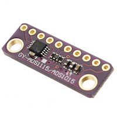
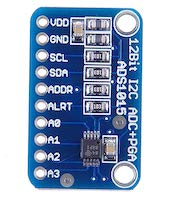

# ADS1015
A Node.js library for an ADS1015 analog to digital converter

Theses are [super inexpensive on amazon](https://amzn.to/2LODx8i)!<br>
<a href="https://amzn.to/35anWrh">

</a>
<a href="https://amzn.to/2LP30yk">

</a>


<br>
(Converting analog joystick input and displaying on an ssd1327)<br>
<br>
The joystick is: [here](https://amzn.to/2LKvvgP)<br>
The display is: [here](https://amzn.to/2pEUCZz)<br>
&nbsp; --> Also checkout my node module for it!: [here](https://npmjs.com/package/ssd1327)<br>


```js
// const connection = [1, 0x48, 'i2c-bus']
//  use an `i2cdriver` board for development!...
const connection = ['/dev/tty.usbserial-DO010000', 0x48, 'i2cdriver/i2c-bus']

ADS1015.open(...connection).then(async (ads1015) => {
  ads1015.gain = 1

  for (let i = 0; i < 1000; i++) {
    let x = await ads1015.measure('0+GND')
    let y = await ads1015.measure('1+GND')
    console.log(x, y)
  }
})
```

**Or, use with an existing bus instance:**
```js
const ADS1015 = require('ads1015')

const i2c = require('i2c-bus')
i2c.openPromisified(1).then(async (bus) => {
  const ads1015 = await ADS1015(bus)
  // ads1015.gain = 1

  for (let i = 0; i < 1000; i++) {
    let value = await ads1015.measure('0+GND')
    console.log(value)
  }
})
```

## Install
https://npmjs.com/package/ads1015

    npm install ads1015 i2c-bus


#### *i2c-bus not included in dependencies
To prevent multiple  instances of [i2c-bus](https://npmjs.com/package/i2c-bus)
being installed in your project- it is NOT included as a dependency. You just
need to install it separately.

This also allows you to swap in a different bus, such as an [i2cdriver](https://npmjs.com/package/i2cdriver) if desired.

## API

### ADS1015(bus, addr = 0x48)
Creates an ADS1015 instance using and existing `bus` object.

### ADS1015.open(busNum, addr = 0x48, provider = 'i2c-bus')
Opens an i2c bus and creates a new `ads1015` instance.

`busNum` - The bus to open<br>
`addr` - The address of the ads1015 device<br>
`provider` - The i2c module to use to open the bus. (default [i2c-bus](https://npmjs.com/package/i2c-bus))<br>
&nbsp;&nbsp; The module must conform to the [i2c-bus](https://npmjs.com/package/i2c-bus)@^5.0.0 interface.<br>
&nbsp;&nbsp; **TIP!** Try an [i2cdriver](https://npmjs.com/package/i2cdriver) for development!

### ads1015.gain
Gets or sets the gain. You can use a `Number` or `String`.

Valid values:<br>
`2/3` = +/- 6.144V (default)<br>
`1`   = +/- 4.096V<br>
`2`   = +/- 2.048V<br>
`4`   = +/- 1.024V<br>
`8`   = +/- 0.512V<br>
`16`  = +/- 0.256V<br>

### ads1015.measure(mux)
Requests a single measurement.

Valid values for `mux` parameter:<br>
`'0+1'` = Differential measurement between A0 & A1<br>
`'0+3'` = Differential measurement between A0 & A3<br>
`'1+3'` = Differential measurement between A1 & A3<br>
`'2+3'` = Differential measurement between A2 & A3<br>
`'0+GND'` = Single-ended measurement on A0<br>
`'1+GND'` = Single-ended measurement on A1<br>
`'2+GND'` = Single-ended measurement on A2<br>
`'3+GND'` = Single-ended measurement on A3<br>

# License
MIT